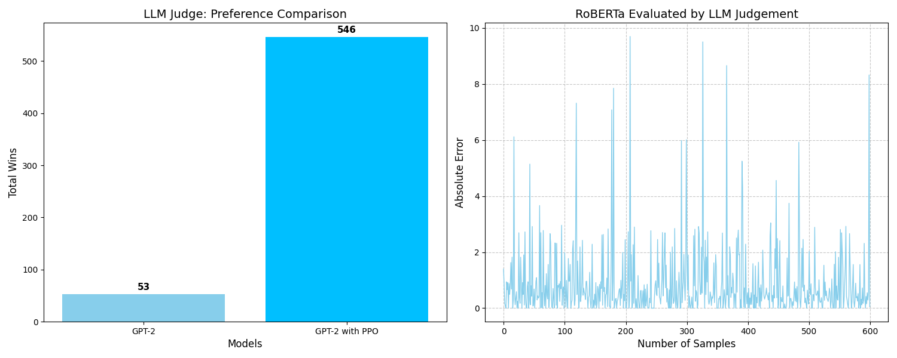

# RLHF Chatbot: Aligning GPT-2 with Human Preferences

## Overview
The goal of this project is to transition a standard GPT-2 model from a basic next-token predictor to an instruction-following agent. By implementing a full **Reinforcement Learning from Human Feedback (RLHF)** pipeline, the model is fine-tuned to align its outputs with human-rated preferences. 

The pipeline consists of three core stages:
1.  **Supervised Fine-Tuning (SFT)**: Initial training on high-quality instruction-response pairs.
2.  **Reward Modeling (RM)**: Training a **RoBERTa-base** model to score outputs based on preference data.
3.  **Proximal Policy Optimization (PPO)**: Optimizing the policy network using the reward model while maintaining stability via a KL-divergence penalty.

## Dataset Information  

This project utilizes the **UltraFeedback Binarized** dataset, which contains pairs of "chosen" and "rejected" responses.

* **Sources:** [UltraFeedback Binarized Preferences](https://huggingface.co/datasets/argilla/ultrafeedback-binarized-preferences-cleaned), [Alpaca Data Cleaned](https://huggingface.co/datasets/yahma/alpaca-cleaned), [Natural Questions](https://huggingface.co/datasets/sentence-transformers/natural-questions?library=datasets)
* **Processing:** Handled via **PySpark** for efficient Parquet data loading and transformation.
* **Evaluation Metrics:** Win Rate (LLM Judge), Reward Scores (RoBERTa), and KL-Divergence stability.

### System Architecture

| Component | Base Model | Purpose |
| :--- | :--- | :--- |
| **Policy Network** | GPT-2 | Generates responses (The Actor). |
| **Value Network** | GPT-2 (Shared) | Predicts expected rewards to reduce PPO variance. |
| **Reward Model** | RoBERTa-base | Acts as the "Judge" to score responses. |
| **Reference Model** | GPT-2 (Frozen) | Provides a baseline to calculate KL-Divergence. |


## File Description

| File Name | Description |
|---|---|
| `SFT` | Supervised Fine-Tuned model fine-tuned from GPT-2. |
| `RM` | Reward Modeling model fine-tuned from RoBERTa. |
| `RL` | Proximal Polocy Optimization of GPT-2 (actor network) and RoBERTa (critic network). |
| `Supervised_Fine_Tuning.py` | Performs SFT on GPT-2. Includes custom heads and left-padding configurations. |
| `Reward_Modeling.py` | Trains the RoBERTa reward model using **Margin Ranking Loss**. |
| `RL_Optimization.py` | The main PPO trainer. Implements the advantage function and policy updates. |
| `Evaluation.py` | Compares SFT vs. RLHF models using **GPT-4o-mini** as an automated judge. |
| `Inference.py` | A **Streamlit** dashboard for real-time interaction with the final chatbot. |
| `ultra_feedback.parquet` | Training dataset. |
| `Prompt_Dataset.xlsx` | Evaluating dataset. |

## Methodology & Analysis

### RLHF Pipeline
1. **SFT Phase**: Fine-tuning GPT-2 on `ultrafeedback-binarized` to establish instruction-following behavior.
2. **Reward Phase**: Training RoBERTa-base as a scalar reward function using a pairwise ranking objective.
3. **PPO Phase**: Optimizing the policy with a KL-penalty of $\beta=0.05$ to ensure linguistic stability.

### Performance Visualization

* **Win Rate**: A head-to-head comparison between SFT and PPO models judged by GPT-4o-mini.
* **Score Calibration**: Correlation analysis between the RoBERTa Reward Model and human preference labels.
* **Loss Convergence**: Tracking Policy vs. Value loss to detect training divergence.

## Set Up

1.  **Clone the Repository**:
    ```bash
    cd "Your Directory"
    git clone https://github.com/Dochikhoa2006/Quora-Question-Pairs-Duplicate-Detection.git
    ```

2.  **Docker**:
    * To build docker image:
        ```bash
        docker build -t rl-human-feedback .
    * To run docker container:
        ```bash
        docker run -p 8501:8501 --name my-streamlit-app rl-human-feedback
        ```

## License

This project is licensed under the **CC-BY (Creative Commons Attribution)** license.

## Citation

Do, Chi Khoa (2026). *Reinforcement Learning from Human Feedback: GPT-2 and RoBERTa Pipeline*.  

🔗 [Project Link](https://github.com/Dochikhoa2006/Quora-Question-Pairs-Duplicate-Detection)

## Contact
If you have any questions or suggestions, please contact [dochikhoa2006@gmail.com](dochikhoa2006@gmail.com).


