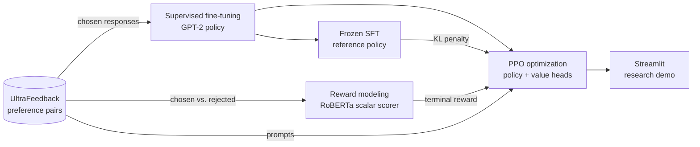
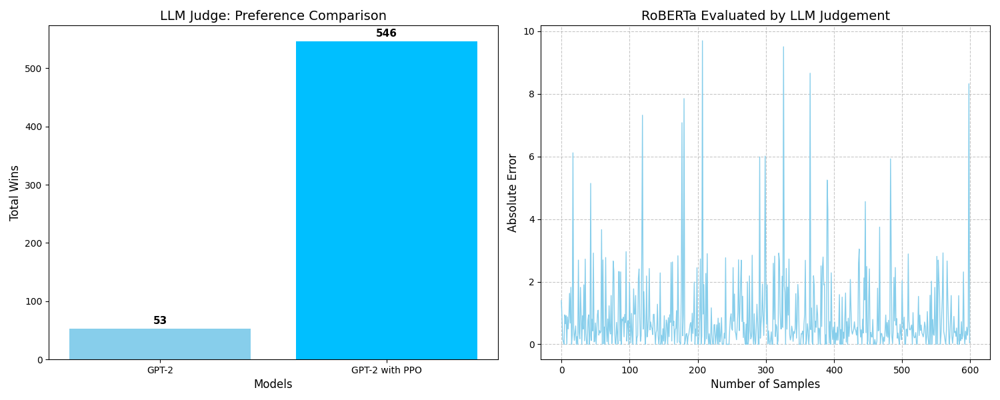

<div align="center">

# RLHF Chatbot

### A transparent GPT-2 alignment pipeline built with supervised fine-tuning, reward modeling, and PPO

[](https://github.com/Dochikhoa2006/Reinforcement-Learning-Human-Feedback-Chatbot/actions/workflows/ci.yml)
[](https://www.python.org/)
[](https://pytorch.org/)
[](LICENSE)

[Architecture](docs/architecture.md) · [Methodology](docs/methodology.md) · [Results](docs/results.md) · [Model card](docs/model-card.md) · [Publishing checklist](docs/publishing-checklist.md)

</div>

## Overview

This repository demonstrates the mechanics of Reinforcement Learning from Human Feedback (RLHF) at
a scale that can be studied end to end. It starts with GPT-2, teaches it an instruction-response
format, learns a scalar preference signal with RoBERTa, and then optimizes the policy with Proximal
Policy Optimization (PPO) under a KL-divergence constraint.

The goal is educational clarity: each alignment stage is implemented explicitly instead of being
hidden behind a high-level trainer.

### Project highlights

- **Complete three-stage pipeline:** supervised fine-tuning, pairwise reward modeling, and PPO.
- **Explicit actor-critic implementation:** GPT-2 shares its backbone with separate policy and value
  heads.
- **Frozen reference policy:** PPO penalizes drift from the original SFT checkpoint.
- **Import-safe architecture:** the web app does not start Spark or load training data.
- **Reproducible interfaces:** typed TOML configuration and one command per pipeline stage.
- **Portfolio-ready engineering:** tests, linting, CI, Docker, Git LFS, model documentation, and
  responsible-use guidance.

## Architecture


```mermaid
flowchart LR
    D[(UltraFeedback\npreference pairs)]
    SFT[Supervised fine-tuning\nGPT-2 policy]
    RM[Reward modeling\nRoBERTa scalar scorer]
    REF[Frozen SFT\nreference policy]
    PPO[PPO optimization\npolicy + value heads]
    APP[Streamlit\nresearch demo]

    D -->|chosen responses| SFT
    D -->|chosen vs. rejected| RM
    SFT --> REF
    SFT --> PPO
    REF -->|KL penalty| PPO
    RM -->|terminal reward| PPO
    D -->|prompts| PPO
    PPO --> APP
```

| Stage | Backbone | Objective | Output |
|---|---|---|---|
| SFT | GPT-2 | Response-only causal cross-entropy | Instruction-conditioned policy |
| Reward model | RoBERTa-base | Pairwise margin-ranking loss | Scalar preference score |
| PPO | GPT-2 + value head | Clipped policy objective + value loss + KL penalty | Aligned policy |

See the [detailed architecture](docs/architecture.md) and the original
[architecture report](docs/architecture.pdf).

## Evaluation snapshot

The stored experiment contains **599 valid automated preference decisions**. The PPO policy won
**546 comparisons (91.2%)**, versus 53 for the SFT baseline.



These are historical, model-graded results—not an independent human evaluation. Judge choice,
prompt order, stochastic generation, and uncalibrated reward scores can materially affect the
numbers. Read [results and limitations](docs/results.md) before interpreting them.

## Repository structure

```text
.
├── app/                       # Streamlit interface
├── artifacts/models/          # SFT, reward, and PPO checkpoints (Git LFS)
├── configs/default.toml       # Versioned experiment configuration
├── data/
│   ├── raw/                   # Local training data (not committed)
│   └── evaluation/            # Local evaluation prompts (not committed)
├── docs/                      # Architecture, methodology, results, and portfolio material
├── scripts/                   # Thin executable wrappers
├── src/rlhf_chatbot/
│   ├── models/                # Policy/value and reward networks
│   ├── training/              # SFT, reward-model, and PPO loops
│   ├── cli.py                 # Command-line interfaces
│   ├── config.py              # Typed TOML settings
│   ├── data.py                # Lazy preference-data adapter
│   └── evaluation.py          # LLM-judge evaluation
└── tests/                     # Fast unit tests
```

## Quick start

### 1. Clone checkpoints with Git LFS

```bash
git lfs install
git clone https://github.com/Dochikhoa2006/Reinforcement-Learning-Human-Feedback-Chatbot.git
cd Reinforcement-Learning-Human-Feedback-Chatbot
git lfs pull
```

### 2. Create an environment

```bash
python3.11 -m venv .venv
source .venv/bin/activate
python -m pip install --upgrade pip
python -m pip install -e ".[all]"
```

For development tooling, install `python -m pip install -e ".[all,dev]"`.

### 3. Launch the trained policy

```bash
streamlit run app/streamlit_app.py
```

Open <http://localhost:8501>. The app loads `artifacts/models/ppo` by default; override it with the
`RLHF_MODEL_DIR` environment variable.

### Docker

```bash
docker build -t rlhf-chatbot .
docker run --rm -p 8501:8501 rlhf-chatbot
```

The runtime image contains only the app and final PPO checkpoint, not Spark or the training data.

## Reproducing the pipeline

Download the UltraFeedback preference data as Parquet and place it at
`data/raw/ultra_feedback.parquet`. Configuration lives in [configs/default.toml](configs/default.toml).

The experiment is based on the
[UltraFeedback Binarized Preferences](https://huggingface.co/datasets/argilla/ultrafeedback-binarized-preferences-cleaned)
format. Review its dataset card, source mixture, license, and synthetic-feedback provenance before
reproducing or extending the training run.

```bash
# 1. Supervised policy
rlhf-train-sft --limit 100

# 2. Pairwise reward model
rlhf-train-reward --limit 100

# 3. PPO alignment
rlhf-train-ppo --limit 25
```

Remove `--limit` for a full run. Use `--device cpu`, `--device cuda`, or `--device mps` to override
automatic device selection. Every command also supports `--config`, explicit input paths, and an
output checkpoint path; run it with `--help` for details.

### Evaluation

Place an Excel file containing a `Prompts` column at `data/evaluation/prompts.xlsx`, then copy the
environment template and add your API key:

```bash
cp .env.example .env
rlhf-evaluate --limit 20
```

Evaluation writes both a PNG visualization and machine-readable JSON summary. API-backed judging
may incur cost.

## Quality checks

```bash
python -m ruff check .
python -m ruff format --check .
python -m pytest
```

GitHub Actions runs the same checks on every pull request without downloading the large checkpoints.

## Scope and responsible use

This is a learning-oriented alignment experiment built on a small, legacy language model. It is not
a production assistant or a safety guarantee. Generated content may be incorrect, biased, repetitive,
or unsafe. Do not use it for high-impact decisions. See the [model card](docs/model-card.md) and
[security policy](SECURITY.md).

## Author

**Chi Khoa Do** — AI/ML researcher and developer

- GitHub: [@Dochikhoa2006](https://github.com/Dochikhoa2006)
- Project: [Reinforcement-Learning-Human-Feedback-Chatbot](https://github.com/Dochikhoa2006/Reinforcement-Learning-Human-Feedback-Chatbot)

If this project is useful, consider starring the repository or opening a research discussion.

Maintainers can use the [GitHub and LinkedIn publishing checklist](docs/publishing-checklist.md) for
the recommended repository description, topics, release steps, and showcase sequence.

## Citation and license

Citation metadata is available in [CITATION.cff](CITATION.cff). This project is licensed under
[CC BY 4.0](LICENSE); attribution is required when reusing the code, documentation, or results.
