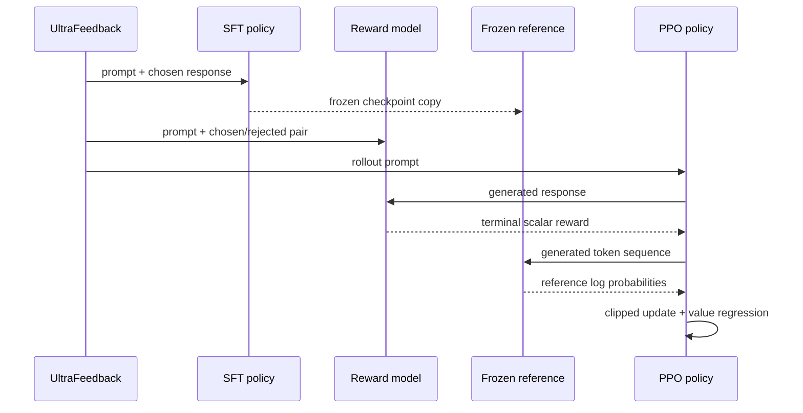

# System architecture

## Design goals

The repository separates research concerns that were previously coupled in top-level scripts:

1. model definitions remain reusable across training, evaluation, and inference;
2. data systems are loaded only by commands that need them;
3. experiment paths and hyperparameters are version controlled;
4. checkpoint formats stay compatible across the three stages;
5. mathematical objectives are independently testable.

## Training data flow

## Components

### Policy and value network

`PolicyValueModel` uses a GPT-2 backbone and two independent linear projections:

- the **policy head** maps every hidden state to token logits;
- the **value head** estimates the return at every sequence position.

The checkpoint stores the Hugging Face backbone/tokenizer plus `policy_head.pt` and
`value_head.pt`. This explicit format makes the actor-critic structure easy to inspect.

### Reward model

`RewardModel` uses RoBERTa-base to encode a prompt-response pair. Masked mean pooling converts token
states into one representation, and a linear ranking head produces the scalar reward. The head is
trained so preferred answers score higher than rejected answers by a configurable margin.

### PPO trainer

PPO begins with two copies of the SFT policy:

- the trainable policy generates a response and receives updates;
- the frozen reference supplies token log probabilities for the KL penalty.

Only generated-response tokens contribute to the policy and value objectives. The learned reward is
applied at the terminal response token, while per-token KL penalties discourage destructive drift.

## Runtime boundaries

| Runtime | Required components | Deliberately excluded |
|---|---|---|
| Streamlit | PyTorch, Transformers, PPO checkpoint | Spark, dataset, reward model, API key |
| SFT training | Spark, preference dataset, base GPT-2 | OpenAI API |
| Reward training | Spark, preference dataset, base RoBERTa | OpenAI API |
| PPO training | Spark, all three model roles | OpenAI API |
| Evaluation | pandas, OpenAI client, three checkpoints | Spark |

This separation keeps inference lightweight and makes dependency failures local to the stage that
uses them.
